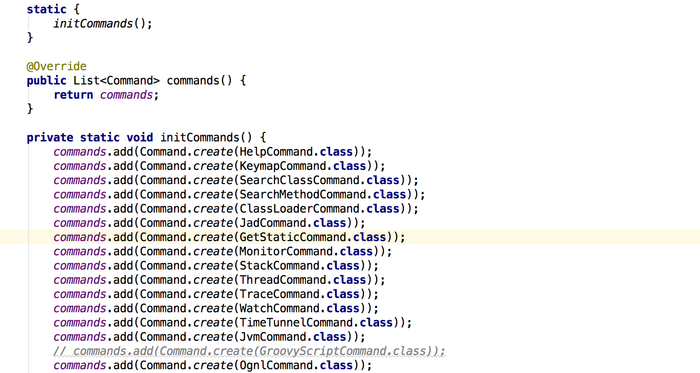

##  Arthas第二篇之agent代理分析

[工具化|Arthas](https://github.com/edagarli/JAVAZeroToOne/blob/master/docs/tools/arthas/arthas-second.md)

接着上一篇，这一篇讨论arthas-agent代理这块。

首先先说下jvm的动态agent机制：
> premain是Java SE5开始就提供的代理方式，由于其必须在命令行指定代理jar，并且代理类必须在main方法前启动。因此，要求开发者在应用前就必须确认代理的处理逻辑和参数内容等等。在有些场合下，premain代理方式不能满足需求。为解决运行时启动代理类的问题，Java SE6开始提供了在应用程序的VM启动后在动态添加代理的方式，即agentmain方式。 
 与Permain类似，agent方式同样需要提供一个agent jar，并且这个jar需要满足：
  1. 在manifest中指定Agent-Class属性，值为代理类全路径
  2. 代理类需要提供public static void agentmain(String args, Instrumentation inst)或public static void agentmain(String   args)方法。并且再二者同时存在时以前者优先。args和inst和premain中的一致。

okay，回到正题. 当arthas执行代码virtualMachine.loadAgent关键一步之后，可以看到这里agent实际上就是arthas-agent。根据上面提到的动态agent机制，可以观察arthas-agent  pom.xml配置如下：

#### 代码块
``` xml
         <descriptorRefs>
             <descriptorRef>jar-with-dependencies</descriptorRef>
         </descriptorRefs>
         <archive>
             <manifestEntries>
                 <Premain-Class>com.taobao.arthas.agent.AgentBootstrap</Premain-Class>
                 <Agent-Class>com.taobao.arthas.agent.AgentBootstrap</Agent-Class>
                 <Can-Redefine-Classes>true</Can-Redefine-Classes>
                 <Can-Retransform-Classes>true</Can-Retransform-Classes>
             </manifestEntries>
         </archive>
```
可以看出Premain-Class以及Agent-Class指定了AgentBootstrap。根据源码可以看出premain，agentmain都调用了以下main方法。
#### 代码块
``` java
private static synchronized void main(final String args, final Instrumentation inst) {
       try {
ps.println("Arthas server agent start...");
    // 传递的args参数分两个部分:agentJar路径和agentArgs, 分别是Agent的JAR包路径和期望传递到服务端的参数
    int index = args.indexOf(';');
    String agentJar = args.substring(0, index);
    final String agentArgs = args.substring(index, args.length());

    File agentJarFile = new File(agentJar);
    if (!agentJarFile.exists()) {
        ps.println("Agent jar file does not exist: " + agentJarFile);
        return;
    }

    File spyJarFile = new File(agentJarFile.getParentFile(), ARTHAS_SPY_JAR);
    if (!spyJarFile.exists()) {
        ps.println("Spy jar file does not exist: " + spyJarFile);
        return;
    }

    /**
     * Use a dedicated thread to run the binding logic to prevent possible memory leak. #195
     */
    final ClassLoader agentLoader = getClassLoader(inst, spyJarFile, agentJarFile);
    initSpy(agentLoader);

    Thread bindingThread = new Thread() {
        @Override
        public void run() {
            try {
                bind(inst, agentLoader, agentArgs);
            } catch (Throwable throwable) {
                throwable.printStackTrace(ps);
            }
        }
    };

    bindingThread.setName("arthas-binding-thread");
    bindingThread.start();
    bindingThread.join();
  } catch (Throwable t) {
        t.printStackTrace(ps);
        try {
            if (ps != System.err) {
                ps.close();
            }
        } catch (Throwable tt) {
            // ignore
        }
        throw new RuntimeException(t);
    }
```
- 该agent会得到一个Instrumentation实例
- 拿到agentJar，spyJar jar文件（spyJar你可以简单理解为钩子类，基于aop有前置方法，后置方法，这样动态增强类，实现相应command功能，这是个伏笔，后面文章command执行这块具体讲到）
- 接下来执行自定义的类加载，getClassLoader这块，首先吧spyJar添加到了BootstrapClassLoader(启动类加载器)，优先加载启动类加载器，spy可以‘藏匿’在各个ClassLoader中。然后把agentJar加载到自定义的ArthasClassloader加载器，这里构造自定义的类加载器，主要是减少Arthas对我们现有工程的侵蚀，
#### 代码块
``` java
private static ClassLoader loadOrDefineClassLoader(File agentJar) throws Throwable {
    if (arthasClassLoader == null) {
        arthasClassLoader = new ArthasClassloader(new URL[]{agentJar.toURI().toURL()});
    }
    return arthasClassLoader;
}
```
- ArthasClassloader继承了URLClassLoader，重写了loadClass方法。（类加载器这里就不多说，不清楚的可以google）
- 接下来初始化spy，首先找到通知编织者com.taobao.arthas.core.advisor.AdviceWeaver，然后对各个方法初始化。（这是个伏笔，后面文章command执行这块具体讲到）
#### 代码块
``` java
private static void initSpy(ClassLoader classLoader) throws ClassNotFoundException, NoSuchMethodException {
     Class<?> adviceWeaverClass = classLoader.loadClass(ADVICEWEAVER);
     Method onBefore = adviceWeaverClass.getMethod(ON_BEFORE, int.class, ClassLoader.class, String.class,
             String.class, String.class, Object.class, Object[].class);
     Method onReturn = adviceWeaverClass.getMethod(ON_RETURN, Object.class);
     Method onThrows = adviceWeaverClass.getMethod(ON_THROWS, Throwable.class);
     Method beforeInvoke = adviceWeaverClass.getMethod(BEFORE_INVOKE, int.class, String.class, String.class, String.class);
     Method afterInvoke = adviceWeaverClass.getMethod(AFTER_INVOKE, int.class, String.class, String.class, String.class);
     Method throwInvoke = adviceWeaverClass.getMethod(THROW_INVOKE, int.class, String.class, String.class, String.class);
     Method reset = AgentBootstrap.class.getMethod(RESET);
     Spy.initForAgentLauncher(classLoader, onBefore, onReturn, onThrows, beforeInvoke, afterInvoke, throwInvoke, reset);
 }
```
- 启动线程，接下来要启动“服务器”了，bind里面做的事情主要是反射调用ArthasBootstrap类的bind方法，用于启动telnet，暴露端口，用于与commad客户端通讯。
#### 代码块
``` java
     ps.println("Arthas start to bind...");
     bootstrapClass.getMethod(BIND, classOfConfigure).invoke(bootstrap, configure);
     ps.println("Arthas server bind success.");
```
- 具体看看启动类ArthasBootstrap怎么bind的，还进行了哪些事情。首先把相关的配置对ShellServer设置对象进行初始化，然后把对象传入到ShellServerImpl核心类中。
#### 代码块
``` java
           ShellServerOptions options = new ShellServerOptions().setInstrumentation(instrumentation).setPid(pid);
           shellServer = new ShellServerImpl(options, this);
           BuiltinCommandPack builtinCommands = new BuiltinCommandPack();
           List<CommandResolver> resolvers = new ArrayList<CommandResolver>();
           resolvers.add(builtinCommands);
           // TODO: discover user provided command resolver
           shellServer.registerTermServer(new TelnetTermServer(
                   configure.getIp(), configure.getTelnetPort(), options.getConnectionTimeout()));
           shellServer.registerTermServer(new HttpTermServer(
                   configure.getIp(), configure.getHttpPort(), options.getConnectionTimeout()));

           for (CommandResolver resolver : resolvers) {
               shellServer.registerCommandResolver(resolver);
           }

           shellServer.listen(new BindHandler(isBindRef));

           logger.info("as-server listening on network={};telnet={};http={};timeout={};", configure.getIp(),
                   configure.getTelnetPort(), configure.getHttpPort(), options.getConnectionTimeout());
           // 异步回报启动次数
           UserStatUtil.arthasStart();
```
- 接下来实例化BuiltinCommandPack，BuiltinCommandPack里面其实initCommands初始化了很多命令，你用的时候看到的help，keymap, watch等命令集合对象全被初始化了。然后加入到命令解析器CommandResolver接入口中（注意BuiltinCommandPack实现CommandResolver）。

- 接下来这一步注册通讯方式，现在支持两种，一种是telnet，一种是websocket，这里默认两种都初始化了，当然这里还可以扩展其他方式，这里做的好点其实可以基于SPI去模块扩展。
#### 代码块
``` java
    shellServer.registerTermServer(new TelnetTermServer(
            configure.getIp(), configure.getTelnetPort(), options.getConnectionTimeout()));
    shellServer.registerTermServer(new HttpTermServer(
            configure.getIp(), configure.getHttpPort(), options.getConnectionTimeout()));
```
- 接下来启动服务器监听了，这里面用到了一个第3方框架[termd][1]（是一款优秀的命令行程序开发框架），下面就是Telnet监听。
``` java
public TermServer listen(Handler<Future<TermServer>> listenHandler) {
     // TODO: charset and inputrc from options
     bootstrap = new NettyTelnetTtyBootstrap().setHost(hostIp).setPort(port);
     try {
         bootstrap.start(new Consumer<TtyConnection>() {
             @Override
             public void accept(final TtyConnection conn) {
                 termHandler.handle(new TermImpl(Helper.loadKeymap(), conn));
             }
         }).get(connectionTimeout, TimeUnit.MILLISECONDS);
         listenHandler.handle(Future.<TermServer>succeededFuture());
     } catch (Throwable t) {
         logger.error(null, "Error listening to port " + port, t);
         listenHandler.handle(Future.<TermServer>failedFuture(t));
     }
     return this;
 }
```
- 最后一步是arthasStart，其实仅仅是用于统计arthas使用情况。 好了，就可以接收客户端的命令输入了。

## 最后

   上面只是我研究过程中，顺带记录下来的，有任何理解不对的地方可以指出来。


[1]: https://github.com/termd/termd
