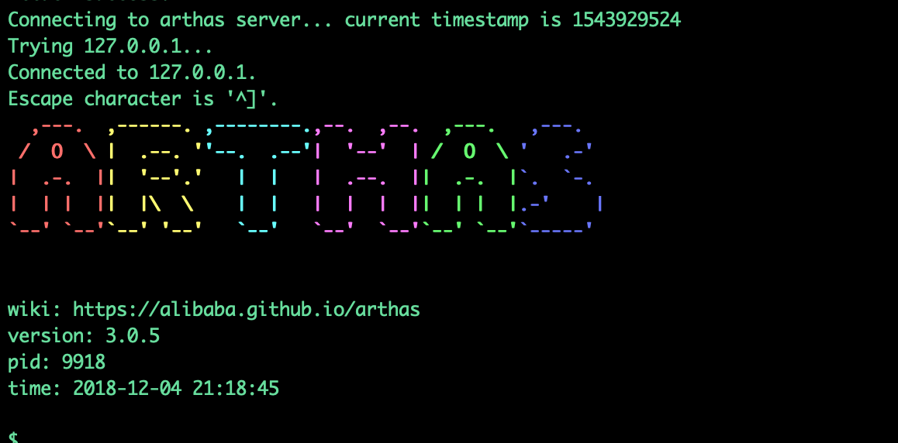

Arthas源码第三篇之命令执行过程

[工具化|Arthas](https://github.com/edagarli/JAVAZeroToOne/blob/master/docs/tools/arthas/arthas-third.md)

这一篇主要聊下输入命令，到最后响应的过程, 顺带着熟悉整个项目结构。（以下会边贴代码边解释，篇幅可能比较长）

接着上一篇ArthasBootstrap bind方法. 在方法内部会发现下面一行代码:
#### 代码块
``` Java
  shellServer.listen(new BindHandler(isBindRef));
```
这行代码主要是监听命令作用，具体到listen方法内部看看:

#### 代码块
``` Java
@Override
 public ShellServer listen(final Handler<Future<Void>> listenHandler) {
     final List<TermServer> toStart;
     synchronized (this) {
         if (!closed) {
             throw new IllegalStateException("Server listening");
         }
         toStart = termServers;
     }
     final AtomicInteger count = new AtomicInteger(toStart.size());
     if (count.get() == 0) {
         setClosed(false);
         listenHandler.handle(Future.<Void>succeededFuture());
         return this;
     }
     Handler<Future<TermServer>> handler = new TermServerListenHandler(this, listenHandler, toStart);
     for (TermServer termServer : toStart) {
         termServer.termHandler(new TermServerTermHandler(this));
         termServer.listen(handler);
     }
     return this;
 }
```
可以看到TermServerTermHandler被实例化, 赋值给TermServer对象，然后TermServer监听（下面telnet监听为例）.
#### 代码块
``` Java
@Override
 public TermServer listen(Handler<Future<TermServer>> listenHandler) {
     // TODO: charset and inputrc from options
     bootstrap = new NettyTelnetTtyBootstrap().setHost(hostIp).setPort(port);
     try {
         bootstrap.start(new Consumer<TtyConnection>() {
             @Override
             public void accept(final TtyConnection conn) {
                 termHandler.handle(new TermImpl(Helper.loadKeymap(), conn));
             }
         }).get(connectionTimeout, TimeUnit.MILLISECONDS);
         listenHandler.handle(Future.<TermServer>succeededFuture());
     } catch (Throwable t) {
         logger.error(null, "Error listening to port " + port, t);
         listenHandler.handle(Future.<TermServer>failedFuture(t));
     }
     return this;
 }
```
* 方法内部启动telnet端口监听。
* Helper.loadKeymap()这个类方法主要是在项目目录inputrc文件里加载对应的快捷键以及对应的处理类name标识，返回个映射对象，对命令行界面快捷键指示处理需要。
* new TermImpl 看看这个类内部实例做了哪些事情
#### 代码块
``` Java
 private static final List<Function> readlineFunctions = Helper.loadServices(Function.class.getClassLoader(), Function.class);
 ...
public TermImpl(Keymap keymap, TtyConnection conn) {
     this.conn = conn;
     readline = new Readline(keymap);
     readline.setHistory(FileUtils.loadCommandHistory(new File(Constants.CMD_HISTORY_FILE)));
     for (Function function : readlineFunctions) {
         readline.addFunction(function);
     }

     echoHandler = new DefaultTermStdinHandler(this);
     conn.setStdinHandler(echoHandler);
     conn.setEventHandler(new EventHandler(this));
 }
```
* TermImpl内部首先可以看到对Function类通过spi进行了所有Function的加载，Function就是刚才快捷键对应的处理类，下面随便看看一个类，快捷键向上看历史命令。
``` Java
public class HistorySearchBackward implements Function {
  @Override
  public String name() {
      return "history-search-backward";
  }
  @Override
  public void apply(Readline.Interaction interaction) {
      LineBuffer buf = interaction.buffer().copy();
      int cursor = buf.getCursor();
      List<int[]> history = interaction.history();

      int curr = interaction.getHistoryIndex();

      int searchStart = curr + 1;

      for (int i = searchStart; i < history.size(); ++i) {
          int[] line = history.get(i);
          if (LineBufferUtils.equals(buf, line)) {
              continue;
          }
          if (LineBufferUtils.matchBeforeCursor(buf, line)) {
              interaction.refresh(new LineBuffer().insert(line).setCursor(cursor));
              interaction.setHistoryIndex(i);
              break;
          }
      }
      interaction.resume();
  }
}
```
* 上面可以看到readline的字段history，通过本地history文件加载出来。我们执行的历史命令都会存储到history文件中。 可以猜测history命令怎么查找所有历史命令，就是这样拿出来的。
* 接着实例化DefaultTermStdinHandler，EventHandler以及对应的赋值，然后结合term框架，对相应的快捷键进行处理，这里就不多说，感兴趣自行去看。下面会重点说明help的整个过程。
* 回到上面termHandler.handle(new TermImpl(Helper.loadKeymap(), conn));这一行代码。回顾一下最上面termServer listen的时候, termServer.termHandler(new TermServerTermHandler(this)); 实例化了TermServerTermHandler。所以这里执行了TermServerTermHandler.handle方法
#### 代码块
``` Java
public class TermServerTermHandler implements Handler<Term> {
  private ShellServerImpl shellServer;

  public TermServerTermHandler(ShellServerImpl shellServer) {
      this.shellServer = shellServer;
  }

  @Override
  public void handle(Term term) {
      shellServer.handleTerm(term);
  }
```
* 然后调到ShellServerImpl.handleTerm方法
#### 代码块
``` Java
public void handleTerm(Term term) {
     synchronized (this) {
         // That might happen with multiple ser
         if (closed) {
             term.close();
             return;
         }
     }
     ShellImpl session = createShell(term);
     session.setWelcome(welcomeMessage);
     session.closedFuture.setHandler(new SessionClosedHandler(this, session));
     session.init();
     sessions.put(session.id, session); // Put after init so the close handler on the connection is set
     session.readline(); // Now readline
 }
```
* 这里就初始化了session对象，然后设置了对应的欢迎语，所以你attach成功后，看到了图形界面，wiki，version等。
   
* 这里注意的是ShellImpl构造把命令列表以及内建命令缓存到session内存。
*  session.readline(); 然后就是等待用户命令输入了，如图中$。 这里利用了term框架封装好的readline方法库，同时根据对应ShellLineHandler来回调处理相应的命令。
#### 代码块
``` Java
public void readline() {
    term.readline(Constants.DEFAULT_PROMPT, new ShellLineHandler(this),
            new CommandManagerCompletionHandler(commandManager));
}
...
public void readline(String prompt, Handler<String> lineHandler, Handler<Completion> completionHandler) {
     if (conn.getStdinHandler() != echoHandler) {
         throw new IllegalStateException();
     }
     if (inReadline) {
         throw new IllegalStateException();
     }
     inReadline = true;
     readline.readline(conn, prompt, new RequestHandler(this, lineHandler), new CompletionHandler(completionHandler, session));
 }
 ...
 public class RequestHandler implements Consumer<String> {
    private TermImpl term;
    private final Handler<String> lineHandler;

    public RequestHandler(TermImpl term, Handler<String> lineHandler) {
        this.term = term;
        this.lineHandler = lineHandler;
    }

    @Override
    public void accept(String line) {
        term.setInReadline(false);
        lineHandler.handle(line);
    }
}
```
* 下面我们就输入help来看下项目整个处理过程.
* help输入来到上面readline方法。最终回调到ShellLineHandler.handle方法,ShellLineHandler handle方法关键步骤处理如下:
#### 代码块
``` Java
      List<CliToken> tokens = CliTokens.tokenize(line);
      CliToken first = TokenUtils.findFirstTextToken(tokens);
      if (first == null) {
          // For now do like this
          shell.readline();
          return;
      }
      String name = first.value();
      if (name.equals("exit") || name.equals("logout") || name.equals("quit")) {
          handleExit();
          return;
      } else if (name.equals("jobs")) {
          handleJobs();
          return;
      } else if (name.equals("fg")) {
          handleForeground(tokens);
          return;
      } else if (name.equals("bg")) {
          handleBackground(tokens);
          return;
      } else if (name.equals("kill")) {
          handleKill(tokens);
          return;
      }
      Job job = createJob(tokens);
      if (job != null) {
          job.run();
      }
```
* 这里做了前置的文件检查以及解析，help命令顺利到了createJob这一步,一层层封装点进去, 这里主要是遍历前面加载到内存的命令,如果找不到，command not found。
* 然后同时创建实例化CommandProcess, 这里要注意的是找到command对应的processHandler赋值给ProcessImpl属性了，这里就埋下伏笔，为后面路由找到HelpCommand。
* 篇幅有限，其他的点这里就不解释下去了。
#### 代码块
``` Java
@Override
  public Job createJob(InternalCommandManager commandManager, List<CliToken> tokens, ShellImpl shell) {
      int jobId = idGenerator.incrementAndGet();
      StringBuilder line = new StringBuilder();
      for (CliToken arg : tokens) {
          line.append(arg.raw());
      }
      boolean runInBackground = runInBackground(tokens);
      Process process = createProcess(tokens, commandManager, jobId, shell.term());
      process.setJobId(jobId);
      JobImpl job = new JobImpl(jobId, this, process, line.toString(), runInBackground, shell);
      jobs.put(jobId, job);
      return job;
  }
 ...
 private Process createProcess(List<CliToken> line, InternalCommandManager commandManager, int jobId, Term term) {
    try {
        ListIterator<CliToken> tokens = line.listIterator();
        while (tokens.hasNext()) {
            CliToken token = tokens.next();
            if (token.isText()) {
                Command command = commandManager.getCommand(token.value());
                if (command != null) {
                    return createCommandProcess(command, tokens, jobId, term);
                } else {
                    throw new IllegalArgumentException(token.value() + ": command not found");
                }
            }
        }
        throw new IllegalArgumentException();
    } catch (Exception e) {
        throw new RuntimeException(e);
    }
}
...
public Command getCommand(String commandName) {
     Command command = null;
     for (CommandResolver resolver : resolvers) {
         // 内建命令在ShellLineHandler里提前处理了，所以这里不需要再查找内建命令
         if (resolver instanceof BuiltinCommandPack) {
             command = getCommand(resolver, commandName);
             if (command != null) {
                 break;
             }
         }
     }
     return command;
 }
```
* 然后创建完job, 继续回到ShellLineHandler job那块代码，上面代码可以看出 job.run(); 对job启动。这里比较重要的是刚才创建的Process对象，这里调用run方法
#### 代码块
``` Java
public Job run(boolean foreground) {
    ...
    process.setTty(shell.term());
    process.setSession(shell.session());
    process.run(foreground);

    if (!foreground && foregroundUpdatedHandler != null) {
        foregroundUpdatedHandler.handle(null);
    }

    if (foreground) {
        shell.setForegroundJob(this);
    } else {
        shell.setForegroundJob(null);
    }
    return this;
}
```
* 然后接着以下关键代码, 关键一步就是最好两行ArthasBootstrap.getInstance().execute(task); 执行这个task，ProcessHandler执行process。
#### 代码块
``` Java
@Override
   public synchronized void run(boolean fg) {
      ...
       CommandLine cl = null;
       try {
           if (commandContext.cli() != null) {
               if (commandContext.cli().parse(args2, false).isAskingForHelp()) {
                   UsageMessageFormatter formatter = new StyledUsageFormatter(Color.green);
                   formatter.setWidth(tty.width());
                   StringBuilder usage = new StringBuilder();
                   commandContext.cli().usage(usage, formatter);
                   usage.append('\n');
                   tty.write(usage.toString());
                   terminate();
                   return;
               }

               cl = commandContext.cli().parse(args2);
           }
       } catch (CLIException e) {
           tty.write(e.getMessage() + "\n");
           terminate();
           return;
       }

       process = new CommandProcessImpl(args2, tty, cl);
       if (cacheLocation() != null) {
           process.echoTips("job id  : " + this.jobId + "\n");
           process.echoTips("cache location  : " + cacheLocation() + "\n");
       }
       Runnable task = new CommandProcessTask(process);
       ArthasBootstrap.getInstance().execute(task);
   }
   ...
   private class CommandProcessTask implements Runnable {

       private CommandProcess process;

       public CommandProcessTask(CommandProcess process) {
           this.process = process;
       }
       @Override
       public void run() {
           try {
               handler.handle(process);
           } catch (Throwable t) {
               logger.error(null, "Error during processing the command:", t);
               process.write("Error during processing the command: " + t.getMessage() + "\n");
               terminate(1, null);
           }
       }
   }
```
* Handler的实现有很多，可以发现ProcessHandler. 这里实现了handle，不过processHandler是在AnnotatedCommandImpl类里面的。（AnnotatedCommandImpl类的话，在之前初始化命令的时候，就已经实例化了，Command.create(HelpCommand.class)）
* process里面instance.process(process)这一步，结合前面埋下的伏笔路由找到对应的HelpCommand的process
#### 代码块
``` Java
private class ProcessHandler implements Handler<CommandProcess> {
     @Override
     public void handle(CommandProcess process) {
         process(process);
     }
 }
 ...
 private void process(CommandProcess process) {
       AnnotatedCommand instance;
       try {
           instance = clazz.newInstance();
       } catch (Exception e) {
           process.end();
           return;
       }
       CLIConfigurator.inject(process.commandLine(), instance);
       instance.process(process);
       UserStatUtil.arthasUsageSuccess(name(), process.args());
   }
```
* HelpCommand里面首先查询session里面的内建命令缓存(还记得前面内建命令缓存吗?), 然后render出对应的help表格界面
#### 代码块
``` Java
@Override
    public void process(CommandProcess process) {
        List<Command> commands = allCommands(process.session());
        Command targetCmd = findCommand(commands);
        String message;
        if (targetCmd == null) {
            message = RenderUtil.render(mainHelp(commands), process.width());
        } else {
            message = commandHelp(targetCmd, process.width());
        }
        process.write(message);
        process.end();
    }
```

## 最后
 1. 整个源码过程中
 2. 上面只是我阅读源码过程中，顺带记录下来的，有任何理解不对的地方可以指出来。
